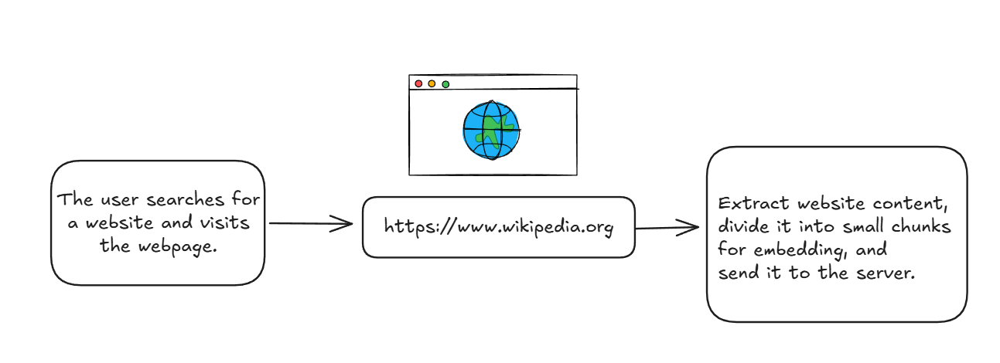
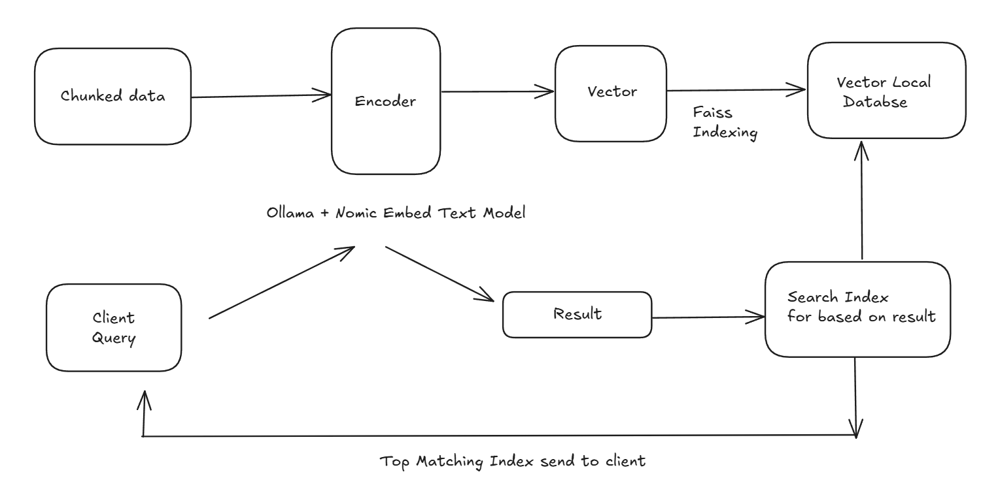

# DeepTrackAI

## 📘 Description

**DeepTrackAI** is a Chrome extension that monitors and stores content from blogs, articles, and other websites. Users can search previously visited pages using natural language queries, and the extension shows results based on meaning, not just keywords.

---

## 📽️ Demo Video

[Watch the demo on YouTube] https://youtu.be/C_PkE_sltCk

## ⚙️ Installation

1. **Extension:**

   - Go to `chrome://extensions`
   - Enable **Developer mode**
   - Click **Load unpacked**
   - Select the `client_ext` folder

2. **Backend:**

   - Install dependencies from `req.txt`:

     ```bash
     pip install -r req.txt
     ```

---

## 📦 Requirements

To run the backend server locally:

1. **Navigate to the backend directory** and run the following commands:

   ```bash
   cd backend

   # Create a virtual environment
   python -m venv venv

   # Activate the virtual environment
   venv\Scripts\activate       # On Windows

   # Start the FastAPI server with hot reload
   uvicorn main:app --reload
   ```

---

## 🚀 Usage Guide

### 📌 Step 1: Search for Content

- Click the extension icon to open the popup.
- Enter your search query in the input box.
- Click the **Search** button.
- Results will appear below with the matching text snippets and page URLs.

---

### 📌 Step 2: View and Highlight Results

- Each result includes a **"Go"** button.
- Clicking **"Go"** will:
  - Open the original page in a new tab.
  - Scroll to and **highlight** the exact matched text or chunk.

---

## 🔍 How It Works

- On visiting a non-search engine page:
  - The extension extracts readable article content using **Readability**.
  - Chunks the content and sends it to the backend at `/embed`.
- On search:
  - The query is sent to the backend at `/search`.
  - The server returns the most relevant content chunks.
- On clicking **"Url"**:
  - The extension opens the target page in a new tab.
  - It waits for the tab to load, then scrolls and highlights the relevant text.

---

## Technical architecture and data flow

### Data Collection and Chunking



### Vector Indexing and Searching



---

## 🧰 Libraries & Technologies Used

### 🧑‍💻 Frontend (Chrome Extension)

- HTML / CSS / JavaScript
- Chrome Extension APIs (tabs, runtime messaging)
- Readability.js – Clean content extraction

### 🧠 Backend (FastAPI Server)

- Python 3.10+
- FastAPI – Web framework
- Uvicorn – ASGI server with hot reload
- Ollama + Nomic embedding model – For semantic vector generation
- FAISS (Facebook AI Similarity Search) – Vector storage and similarity search
- pydantic – Input validation
- Persistent FAISS index storage for data retention across sessions
- Robust error handling for embedding service failures
